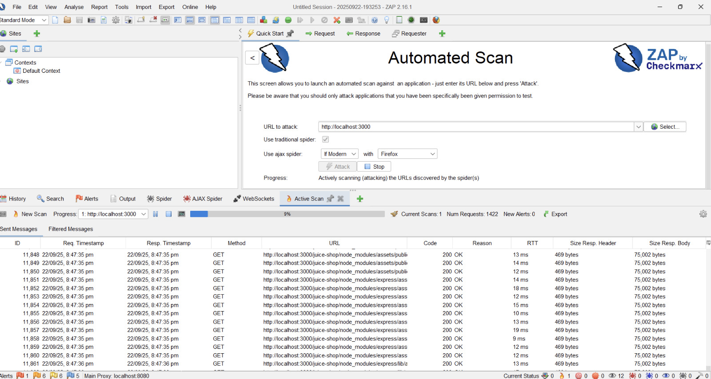
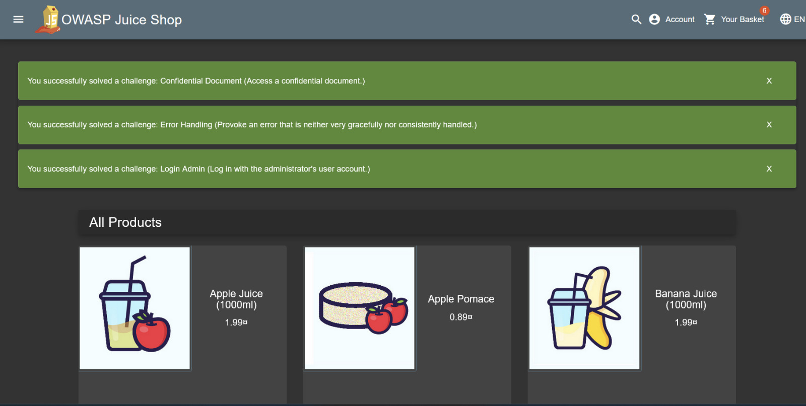

# Application Security Audit of OWASP Juice Shop

## Objective
This project demonstrates a full-cycle security assessment of a modern web application. The objective was to identify, analyze, document, and propose remediations for critical security vulnerabilities, mirroring the responsibilities of an Application Security Engineer. The entire process focuses on integrating security within the Software Development Lifecycle (SDLC) by identifying risks and providing actionable guidance to development teams.

---

## Tools & Technologies
* **Target Application:** OWASP Juice Shop (v14.3.0)
* **Containerization:** Docker
* **Vulnerability Scanner (DAST):** OWASP ZAP (Zed Attack Proxy)
* **Reporting:** Markdown

---

## Methodology

The security audit followed a structured, four-phase approach:

1.  **Environment Setup:** Deployed the target application locally in a controlled environment using Docker. This ensures a safe and repeatable testing setup.
2.  **Vulnerability Assessment:** Performed Dynamic Application Security Testing (DAST). This involved:
    * **Automated Scanning:** Used OWASP ZAP's automated scanner to crawl the entire application and identify a baseline of potential vulnerabilities.
    * **Manual Penetration Testing:** Focused on high-impact vulnerabilities like the OWASP Top 10, specifically targeting Authentication and Injection flaws.
3.  **Analysis & Reporting:** Analyzed the findings from both automated and manual tests. Each critical vulnerability was documented in a detailed report, including its description, severity, business impact, and a step-by-step proof of concept.
4.  **Remediation Proposal:** For each finding, a secure coding practice was recommended as a remediation strategy. This included providing "insecure" vs. "secure" code samples to provide clear, actionable advice.

---

## Summary of Findings

The following critical vulnerabilities were identified and documented:

| Vulnerability ID | Vulnerability Type                  | Severity | Report Link                                                 |
| :--------------- | :---------------------------------- | :------- | :---------------------------------------------------------- |
| VULN-001         | SQL Injection (Authentication Bypass) | Critical | [View Report](./vulnerability-reports/SQL-Injection-Report.md) |
| VULN-002         | Stored Cross-Site Scripting (XSS)   | High     | [View Report](./vulnerability-reports/XSS-Report.md)          |

---

## Conclusion & Key Learnings
This project provided hands-on experience in the core duties of an Application Security Engineer. Key takeaways include the effectiveness of combining automated scanning with manual testing to uncover critical flaws, the importance of clear and detailed documentation, and the process of translating technical risks into business impact.