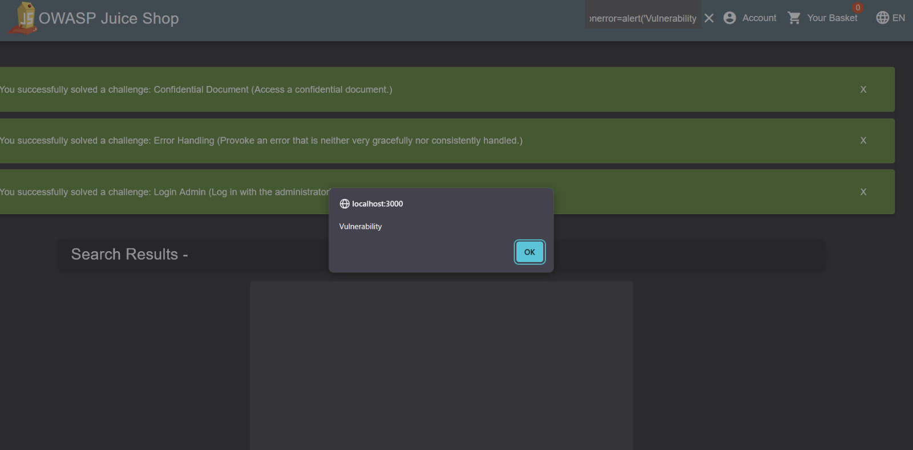

# Vulnerability Report: Stored Cross-Site Scripting (VULN-002)

- **Vulnerability Type:** Stored Cross-Site Scripting (XSS)
- **CWE Reference:** [CWE-79: Improper Neutralization of Input During Web Page Generation ('Cross-site Scripting')](https://cwe.mitre.org/data/definitions/79.html)
- **Severity:** **High**

---

### Description
The application's search functionality is vulnerable to Stored Cross-Site Scripting. User-supplied input in the search bar is saved and later rendered on the page without proper output encoding or sanitization. This allows an attacker to inject malicious client-side scripts (e.g., JavaScript) that will be executed in the browsers of any user who views the infected page.

### Proof of Concept (PoC)
1.  Log into the application.
2.  Click the search icon in the navigation bar.
3.  In the **Search** field, enter the payload: `<script>alert('XSS by Manickavel!')</script>`
4.  Press Enter.
5.  **Result:** An alert box immediately appears on the screen with the message "XSS by Manickavel!". This script is now "stored" and may re-execute for other users.

**(  SCREENSHOT )**




### Business Impact
An attacker can leverage this vulnerability to execute arbitrary JavaScript in a victim's browser, leading to:
-   **Session Hijacking:** Stealing session cookies to impersonate the user.
-   **Phishing:** Redirecting users to malicious websites to steal credentials.
-   **Keylogging:** Capturing user keystrokes, including passwords and personal information.
-   **Website Defacement:** Modifying the content and appearance of the page.

### Recommended Remediation
The primary solution is to implement **Context-Sensitive Output Encoding**. All user-supplied data must be encoded *right before* it is rendered on the HTML page to ensure the browser interprets it as text, not as active code.

#### Insecure Code Example (Conceptual - using a template language)
```html
<div>You searched for: {{ user_query }}</div>


#### Secure Code Example (Conceptual)

```HTML

<div>You searched for: {{ encodeHTML(user_query) }}</div>

Using a modern web framework with built-in, automatic output encoding is the most robust defense against XSS.

#### Example snippets used 

Image onerror (works if attributes can run handlers):


SVG/onload:

<svg/onload=alert('XSS')>

Broken image + onerror:


Inline event on an element:

<button onclick="alert('XSS')">Click</button>

